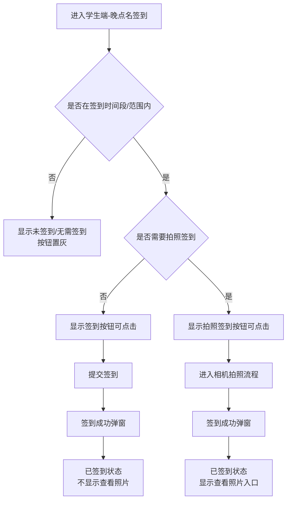
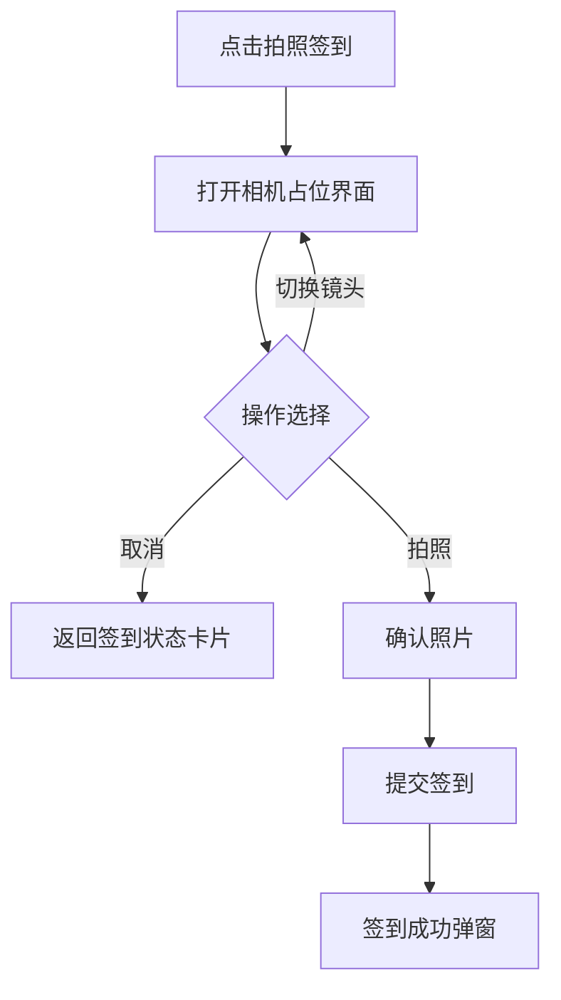
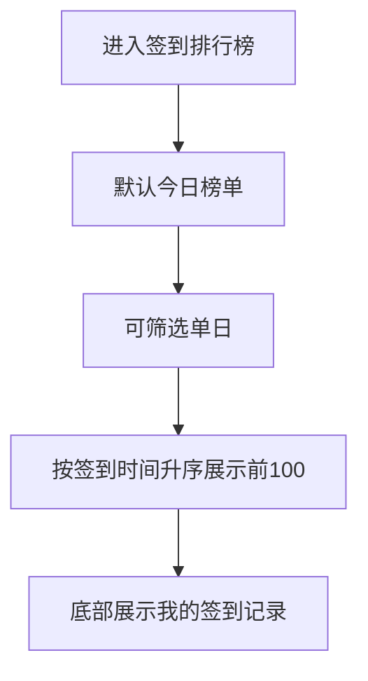

# 学生端晚点名签到原型文档（增强版）

## 1. 页面目标
- 提供学生端晚点名签到入口与状态展示
- 支持普通签到与拍照签到两种模式
- 提供签到记录、补签申请与签到排行榜

## 2. 页面结构
- 顶部区域：页面标题与模块入口（晚点名签到）
- 签到状态卡片区：未签到 / 签到 / 拍照签到 / 已签到 / 查看照片
- 拍照要求说明区：规则说明 + 确认按钮
- 相机拍照区：相机占位 + 切换镜头 / 取消
- 成功反馈弹窗：签到成功 + 知道了
- 记录区：按月份的签到记录列表 + 状态与操作
- 排行榜区：今日签到排行榜 + 筛选入口 + 我的记录

## 3. 关键文案与按钮
- 状态文案：未签到、签到、拍照签到、已签到
- 时间段文案：签到时间段 18:00:00 - 22:00:00
- 操作按钮：查看照片、切换镜头、取消、拍照、知道了、申请补签
- 说明文案：
  - 未在签到时间或不在签到范围内，显示《未签到》，按钮置灰
  - 无需签到名单显示《无需签到》，按钮置灰
  - 在拍照时间且在范围内：
    - 不需要拍照：显示《签到》按钮可点击
    - 需要拍照：显示《拍照签到》按钮可点击
  - 非拍照签到成功后不显示“查看照片”按钮

## 4. 交互流程图

### 4.1 签到主流程


### 4.2 拍照签到子流程


### 4.3 签到记录与补签流程
```mermaid
flowchart TD
  A[进入签到记录] --> B[按月份筛选]
  B --> C[列表展示每天状态]
  C --> D{是否未签到且允许补签}
  D -- 否 --> E[仅展示状态/查看照片]
  D -- 是 --> F[点击申请补签]
  F --> G[填写补签表单]
  G --> H[提交补签申请]
  H --> I[状态显示补签中]
  I --> J{补签结果}
  J -- 通过 --> K[已签到(更改)]
  J -- 拒绝 --> L[申请补签可再次发起]
```

### 4.4 排行榜流程


## 5. 字段表

### 5.1 签到任务（AttendanceTask）
| 字段 | 类型 | 说明 |
| --- | --- | --- |
| id | string | 签到任务ID |
| name | string | 任务名称（晚点名签到） |
| timeStart | string | 签到开始时间（18:00:00） |
| timeEnd | string | 签到结束时间（22:00:00） |
| requirePhoto | boolean | 是否要求拍照签到 |
| inRange | boolean | 是否在签到范围内 |
| needCheckIn | boolean | 是否需要签到（无需签到名单为 false） |
| status | string | 当前状态：未签到/已签到/无需签到 |

### 5.2 签到记录（AttendanceRecord）
| 字段 | 类型 | 说明 |
| --- | --- | --- |
| id | string | 记录ID |
| taskId | string | 对应签到任务 |
| userId | string | 学生ID |
| checkInAt | string | 实际签到时间 |
| status | string | 未签到/已签到/拍照签到/无需签到/补签中/已签到(更改)/未签到(更改) |
| photoUrl | string | 拍照签到照片URL（可选） |
| canAppeal | boolean | 是否可申请补签 |
| appealStatus | string | 补签状态：待处理/通过/拒绝（可选） |

### 5.3 拍照要求（PhotoRule）
| 字段 | 类型 | 说明 |
| --- | --- | --- |
| id | string | 规则ID |
| taskId | string | 关联签到任务 |
| description | string | 规则文本（示例：宿舍号背景、门牌号比V等） |

### 5.4 补签申请（AppealRequest）
| 字段 | 类型 | 说明 |
| --- | --- | --- |
| id | string | 申请ID |
| recordId | string | 对应签到记录 |
| reason | string | 补签理由 |
| status | string | 处理中/通过/拒绝 |
| createdAt | string | 申请时间 |
| updatedAt | string | 审核时间 |

### 5.5 排行榜项（RankItem）
| 字段 | 类型 | 说明 |
| --- | --- | --- |
| userId | string | 学生ID |
| userName | string | 学生姓名 |
| checkInAt | string | 签到时间 |
| rank | number | 排名 |
| isSelf | boolean | 是否为当前用户 |

## 6. 状态映射与按钮规则
- 未在时间段/范围内：显示未签到，按钮置灰
- 无需签到名单：显示无需签到，按钮置灰
- 在时间段内：
  - requirePhoto = false：显示“签到”按钮可点击
  - requirePhoto = true：显示“拍照签到”按钮可点击
- 签到成功：
  - 普通签到：不显示查看照片
  - 拍照签到：显示查看照片入口

## 7. UI 组件清单（建议）
- AttendanceStatusCard（未签到/签到/拍照签到/已签到）
- CheckInTimeBadge（签到时间段）
- PhotoRequirementPanel（拍照要求说明 + 知道了）
- CameraOverlay（相机占位 + 切换镜头/取消）
- SuccessModal（签到成功 + 知道了）
- AttendanceRecordList（按月分组记录 + 申请补签）
- AttendanceLeaderboard（排行列表 + 筛选 + 我的记录）
